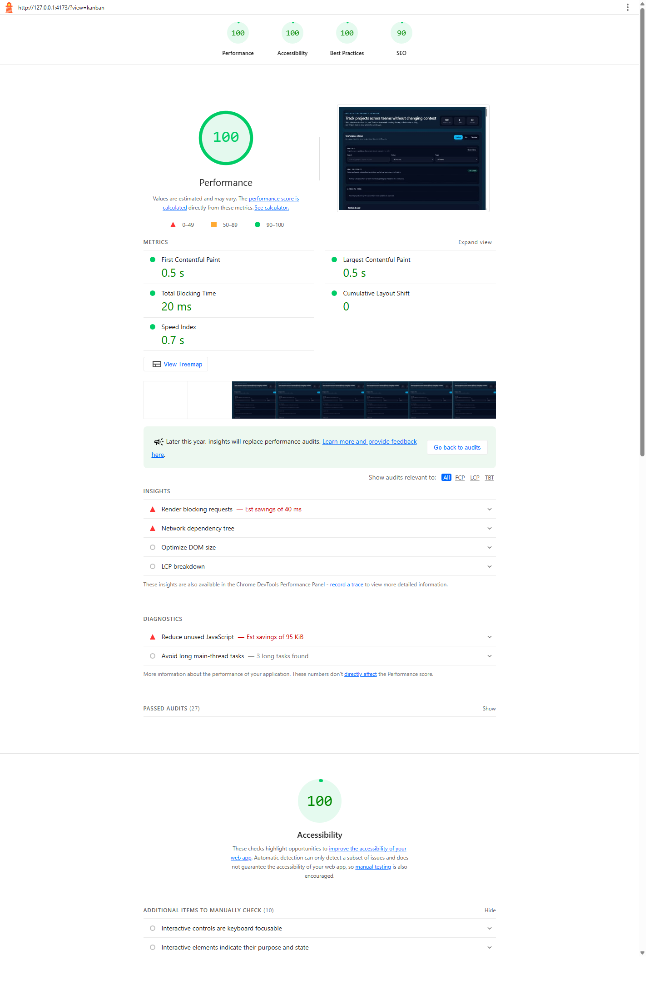

### Multi-View Project Tracker UI

A production-style React + TypeScript project tracker built with Vite, Tailwind CSS, and Zustand.

### Setup Instructions

1. Install dependencies:

```bash
npm install
```

2. Start the development server:

```bash
npm run dev
```

3. Build the production bundle:

```bash
npm run build
```

4. Preview the production build locally if needed:

```bash
npm run preview
```

### State Management Decision

I chose Zustand over Context because this UI has multiple cross-cutting concerns that need to stay in sync: active view, filters, project ordering, Kanban moves, and collaboration activity. Context would work for a small app, but once drag-and-drop and shared filters were added, it would become easy to create a large provider with frequent rerenders. Zustand keeps the store small, lets each component subscribe only to the slice it needs, and keeps actions like `setFilters`, `moveProject`, and `reorderProject` easy to reason about.

### Virtual Scrolling Approach

The original implementation explored custom virtual scrolling with fixed row math in the `List` view. The core idea was to calculate a visible window from `scrollTop`, a known `rowHeight`, and an overscan buffer, then only render the rows inside that range. After testing the UX, I replaced the final `List` view with a stable professional table because readability was more important than forcing virtualization where it hurt the layout. The hook and the experiment are still part of the work history and show how the optimization was approached from scratch.

### Drag-and-Drop Approach

The Kanban board uses a custom pointer-based drag-and-drop implementation without any external drag library. On pointer down, the app stores a drag candidate. Once movement passes a threshold, it becomes an active drag. During pointer movement, the board checks which column is under the pointer and, for in-column reordering, compares the pointer position with each card midpoint to compute an insertion index. On pointer up, the drag commits through a Zustand action so the interaction layer stays separate from the state update logic. This kept the behavior modular and made reordering easier to debug.

### Lighthouse

Desktop Lighthouse audit files are included in the project root:

- `lighthouse-report.report.html`
- `lighthouse-report.report.json`
- `lighthouse-screenshot.png`

Latest desktop scores:

- Performance: 100
- Accessibility: 100
- Best Practices: 100
- SEO: 90

Lighthouse screenshot:



### Explanation (Problem)

The hardest UI problem was building custom Kanban drag-and-drop without relying on a library while still keeping the interaction predictable. The difficult part was not only moving a card between columns, but also computing the correct insertion point inside a column in a way that felt stable. I solved that by splitting the feature into two layers: pointer logic in the view and ordering logic in the Zustand store. The view handled pointer movement, detected the hovered column, and compared the cursor position to each card midpoint. The store only handled the data mutation. To avoid layout shift during dragging, I kept the original card in the column with reduced opacity and rendered the dragged preview as a separate fixed-position floating element. I also inserted a lightweight drop indicator where the card would land, so the board structure stayed intact instead of collapsing during drag. With more time, I would refactor the remaining interaction layer into reusable hooks and add full keyboard-operable drag-and-drop for the Kanban cards, not just accessible tab navigation for switching views.

### Project Structure

```text
src/
  components/
    layout/
    navigation/
  data/
  features/
    projects/
    views/
  store/
  types/
```


